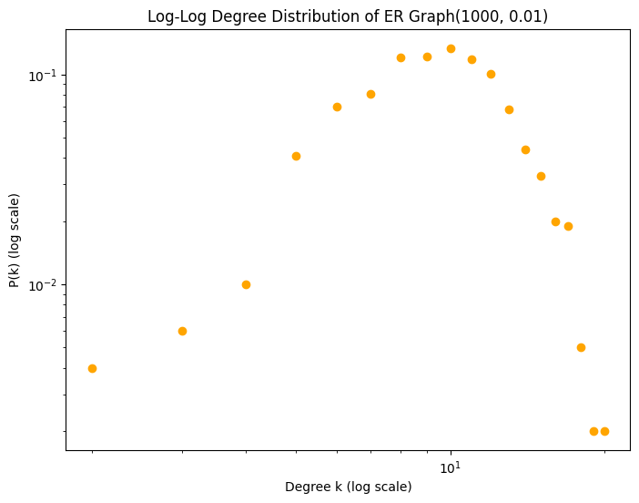
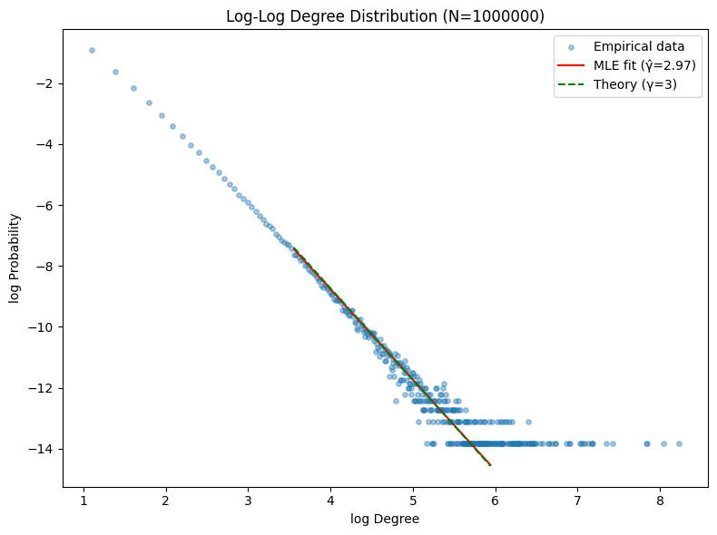
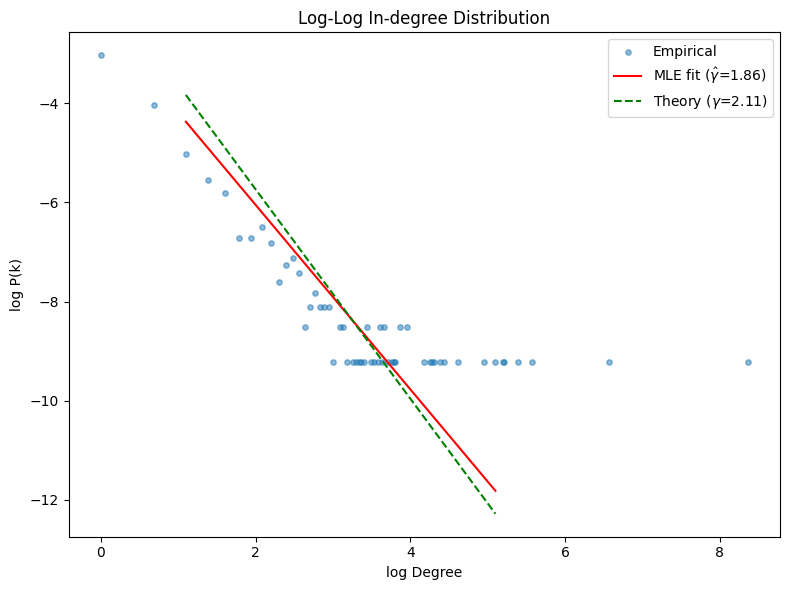
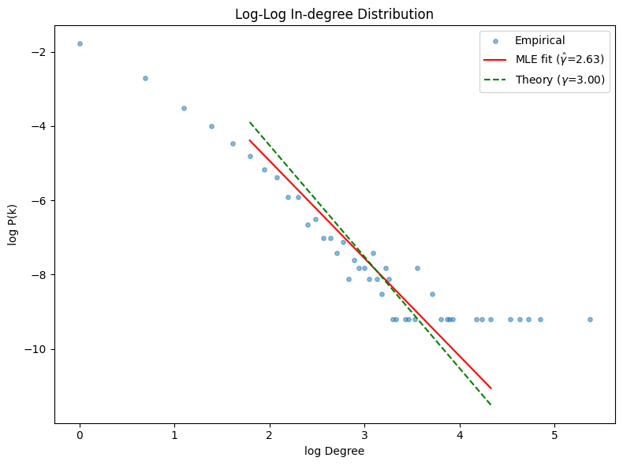
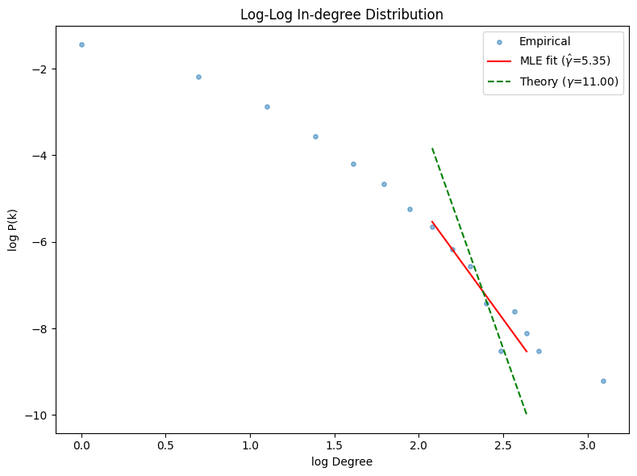

# Comparative Analysis of Random Graph Models for Power-Law Networks

This project analyzes and compares several random graph models to understand how well they reproduce **power-law degree distributions**, a common feature of real-world networks such as social, biological, and information systems.

---

## 🎯 Project Overview

This work was part of my **Master’s Thesis at Uppsala University**, supervised by Dr. Sascha Troscheit.  
The project compares three classical random graph models:

1. **Erdős–Rényi (ER)** — edges appear independently with fixed probability  
2. **Barabási–Albert (BA)** — preferential attachment leading to scale-free networks  
3. **Copying Model (CM)** — new nodes duplicate edges from existing ones with certain probability  

The goal was to evaluate which mechanisms best generate **power-law degree distributions** and capture structural properties observed in complex systems.

---

## 🧮 Methodology

- Implemented all models in **Python**, using `networkx`, `numpy`, and `matplotlib`.
- Generated networks of varying sizes (from 1,000 to 10,000 nodes).
- Calculated:
  - **Degree distributions**
  - **Clustering coefficients**
  - **Average path lengths**
- Fitted power-law exponents using **Maximum Likelihood Estimation (MLE)**.
- Evaluated model fit via **Kolmogorov–Smirnov distance** and log–log plots.

---

## 📊 Results Summary

| Model | Degree Distribution | Power-Law Fit | Structural Features |
|--------|--------------------|----------------|--------------------|
| Erdős–Rényi | Poisson-like | ❌ Poor fit | Low clustering, short paths |
| Barabási–Albert | Power-law (α ≈ 2.9) | ✅ Strong | High hub dominance |
| Copying Model | Power-law (α ≈ 3.0) | ✅ Good | Balanced connectivity |

**Key Insights:**
- ER model fails to capture heavy-tailed behavior.  
- Both BA and Copying models generate realistic power-law networks.  
- Copying model fits empirical distributions better for moderate-degree nodes.  

---

## 🔬 Visualization Examples

| Model | Example Graph |
|--------|---------------|
| Erdős–Rényi |  |
| Barabási–Albert |  |
| Copying Model |  |
                |  |
                |  |

---

## 🧠 Discussion

This study highlights that both **preferential attachment** and **local copying** mechanisms play crucial roles in forming scale-free networks.  
While BA emphasizes hub formation, the Copying model produces smoother degree distributions, suggesting hybrid mechanisms may explain real-world network growth.

---

## 🧩 Technologies Used

`Python` · `NetworkX` · `NumPy` · `Matplotlib` · `SciPy`

---

## 🚀 Future Work

- Extend analysis to **directed** or **weighted** networks  
- Include **community detection** and **assortativity** metrics  
- Compare with **real-world datasets** (e.g., citation or social graphs)

---

## 👩‍💻 Author

**Jie**  
M.Sc. in Applied Mathematics and Statistics, Uppsala University  
📎 [GitHub Profile](https://github.com/JieWang0825)
